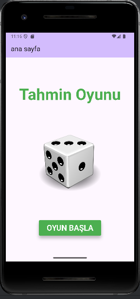
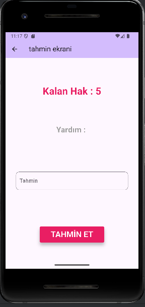
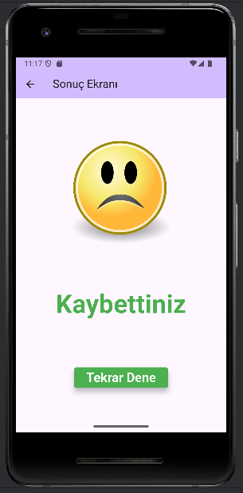
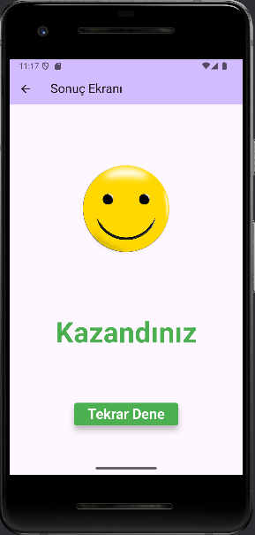

# Number Guessing Game

This project is a simple number guessing game developed with Flutter.  
The user tries to guess a randomly generated number within a range, and the app checks if the guess is correct.

---

## Features

- Random number generation  
- User input for guesses  
- Guess validation and feedback  
- Hints for too high or too low guesses  
- Simple and user-friendly interface  

---

## Screenshots

_Below are screenshots showcasing different parts of the app:_

    

---

## How to Run

1. Make sure Flutter SDK is installed.  
2. Clone or download the project folder.  
3. Navigate to the project directory in the terminal.  
4. Run `flutter pub get` to install dependencies.  
5. Run `flutter run` to launch the app.

